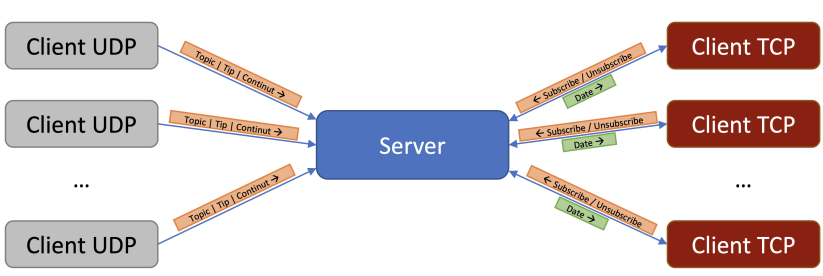

# Message management application using TCP and UDP client-server
## General description

The platform contains three components:

- The server will make the connection between the clients in the platform, for the purpose of publishing and subscribing to messages.
- TCP clients will have the following behavior: a TCP client connects to the server, can receive (at any time) subscribe and unsubscribe commands from the keyboard (interaction with the human user) and display the messages received from the server on the screen.
- The UDP clients (which came ready-implemented by the responsible team) publish, by sending to the server, messages in the proposed platform using a predefined protocol.


The functionality is for each TCP client to receive from the server those messages, coming from the client, and UDP, which refer to the topics to which they are subscribed (as can be seen in the image below). The application will also include a SF (store-and-forward) functionality regarding the messages sent when TCP clients are disconnected.



## Server
The server will have the role of broker (intermediation component) in the message management platform. It will open 2 sockets (one TCP and one UDP) on a port received as a parameter and will wait for connections/datagrams on all locally available IP addresses.

1)  **Starting**

	Starting the server will be done using the command:
	```./server <PORT_DORIT>```
2) **Messages displayed**
	To monitor the server's activity, the connection and disconnection events of the TCP clients will be displayed (on the standard output). This will be done using messages of the form:
	```
	New client connected from IP:PORT.
	Client disconnected.
	```
3) **Accepted commands**
	The server will accept, from the keyboard, only the command **exit**, which will have the effect of simultaneously closing the server and all TCP clients connected at that moment.
4) **Communication with UDP clients**
	The server will receive messages from UDP clients, respecting the format defined in the table below:
	| _ | **topic** | **data_type** | **data** |
	|--|--|--|--|
	| **Dimension** | 50 bytes | 1 byte | Maximum 1500 bytes | 
	|	**Format** | String of maximum 50 characters, terminated with \0 for sizes less than 50 | unsigned int 1 byte used to specify the data type of the content | Variable depending on the data type, as described in the TCP section |
## TCP clients
TCP clients can subscribe and unsubscribe to topics through messages sent to the server.
1) **Starting**
	Starting a TCP client is done with the following command:
	```./subscriber <ID_CLIENT> <IP_SERVER> <PORT_SERVER>```
	
	In the command above, **ID_CLIENT** is a character string that represents the client ID, **IP_SERVER** represents the IPv4 address of the server represented using dotted-decimal notation (example 1.2.3.4), and **PORT_SERVER ** represents the port on which the server is waiting for connections. At startup, the client connects to the server with the ID given as a parameter.
2) **Orders accepted**
	TCP clients can receive one of the following commands from the keyboard:
	- ```subscribe <TOPIC> <SF>``` - informs the server that a client wants to subscribe to messages on the topic TOPIC, and SF can have the value 0 or 1 (it will be explained in the section with the Functionality of the application)
	- ```unsubscribe <TOPIC>``` - notify the server that a client wants to unsubscribe from the topic **TOPIC**
	- **exit** - the command will be used to disconnect the client from the server and close it.
3) **Messages displayed**
	For each command received from the keyboard, the client will display a feedback line of the following type:
	```
	Subscribed to topic. 
	Unsubscribed from topic.
	```
	These messages will be displayed only after the commands have been sent to the server.
For each message received from the server (that is, data from a topic to which the client is subscribed), a message of the form will be displayed immediately:
	```<IP_CLIENT_UDP>:<PORT_CLIENT_UDP> - <TOPIC> - <TIP_DATE> - <VALOARE_MESAJ>```
	For example, if a UDP client with IP address 1.2.3.4 publishes to the topic UPB/precis/1/temperature the value 23.5 as a real number with 2 decimal places, using the source port 4573, then the client will display:
	```1.2.3.4:4573 - UPB/precis/1/temperature - SHORT_REAL - 23.5```
	For the data types, the notations from the table below will be used, and the values will be displayed in human-readable format.
	| **Payload Type** | **Type identifier (used by clients)** | **Data type value** | **Payload Format** |
	|--|--|--|--|
	| Unsigned integer | INT | 0 | Sign byte followed by a uint32_t formatted according to network byte order |
	| Positive real number with 2 decimal places | SHORT REAL | 1 | uint16_t representing the modulus of the number multiplied by 100 |
	| Real number | FLOAT | 2 | A sign byte, followed by a uint32_t (in network byte order) representing the modulus of the number obtained from pasting the whole part to the decimal part of the number, followed by a uint8_t representing the modulus of the negative power of 10 by which the modulus must be multiplied to obtain the number original (in module) | 
	| Character string | STRING | 3 | String of maximum 1500 characters, terminated with \0 or delimited by the end of the datagram for smaller lengths |
    
	*The sign byte will be 0 for positive numbers, 1 for negative ones
## Operation of the application
The initialization of the application is given by starting the server, to which a variable number of TCP and UDP clients will be able to connect afterwards.
Each TCP client will be identified by the ID with which it was started (ID_CLIENT), which can be a string of maximum 10 ASCII characters. At a given moment, there will not be 2 TCP clients connected with the same ID. If a TCP client tries to connect to the server with the same ID as another already connected client, the server will display the following message (at the same time, the client will close):
```Client <ID_CLIENT> already connected.```
The server must keep track of the topics to which each of the clients is subscribed. Upon receiving a valid UDP message, the server must ensure that it is sent to all TCP clients that are subscribed to the respective topic.
The command to subscribe to a topic has a SF (store-and-forward) parameter. If this is set to 1, it means that a client wants to make sure that it does not lose any message sent on that topic. Thus, if a TCP client disconnects, then comes back, it receives from the server all messages that have not already been sent to it, even if they were sent while the client was disconnected, according to a store-type policy and-forward.

## Test ##
To test the application run:
```python3 test.py```